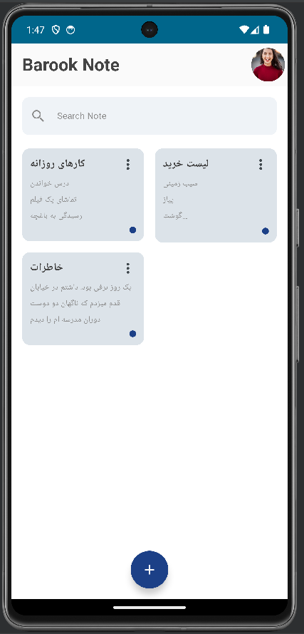
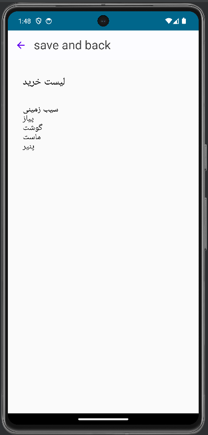
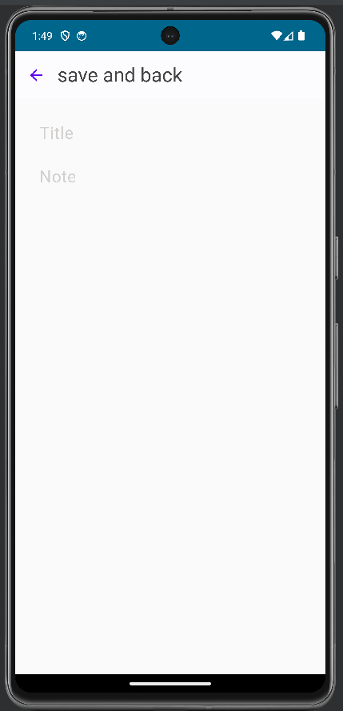
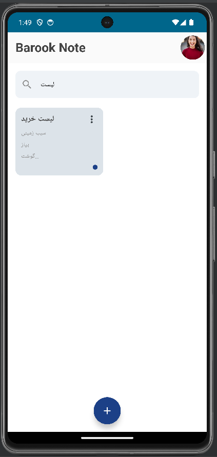

# Note Application

The note application can add, delete, and edit notes, as well as the ability to search between notes. New technologies have been used in its development:
- Room
- Kotlin Coroutine
- Kotlin Flow
- Hilt
- Navigation

## Demo
Note List                                                                |  Note                                                                           | Add new note                                                                   | Search
:---------------------------------------------------------------------------:|:-----------------------------------------------------------------------------:|:-----------------------------------------------------------------------------:|:-----------------------------------------------------------------------------:
  |       |       | 

## 🔗 Contact

